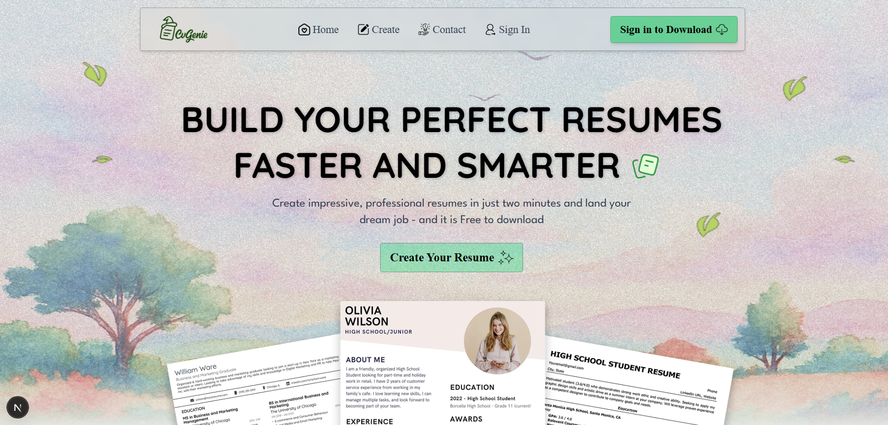

# **CVGenie – Build Your Perfect Resumes Faster and Smarter**



  

## 🌟 Overview

🚀 **CVGenie** is a modern resume builder application that allows users to create professional, high-quality resumes in minutes. With a **real-time preview, customizable sections, and instant PDF export**, CVGenie simplifies the job application process, helping you land your dream job effortlessly.

---

## **🌟 Features**

✅ **Real-Time Resume Preview** – See changes instantly as you type your information.
✅ **Customizable Sections** – Effortlessly add details for Experience, Education, Skills, Projects, and Achievements.
✅ **Instant PDF Export** – Download your professionally formatted resume as a PDF file with one click.
✅ **User Authentication** – Secure login and registration using **NextAuth.js** with Google and Email/Password options.
✅ **Database Integration** – Persistent data storage using **Prisma ORM** and **PostgreSQL**.
✅ **Responsive Design** – Optimized for both desktop and mobile devices.
✅ **Contact System** – Dedicated contact page with form validation and simulated processing.

---

## 💻 Tech Stack

| **Category**   | **Technology**                      |
| -------------- | ----------------------------------- |
| Frontend       | Next.js 15, React 19, Tailwind CSS 4 |
| Backend        | Next.js API Routes, Prisma ORM      |
| Database       | PostgreSQL                          |
| Authentication | NextAuth.js                         |
| PDF Generation | jsPDF                               |
| Icons          | Lucide React                        |
| Deployment     | Vercel                              |

---

## 📥 Installation

1. Clone the repository:
   ```bash
   git clone https://github.com/andi-nugroho/cvgenie.git
   cd cvgenie
   ```
2. Install dependencies:
   ```bash
   npm install
   ```
3. Set up environment variables:
   - Create a `.env` file in the root directory.
   - Add the following required keys:
   ```env
   DATABASE_URL="your_postgresql_url"
   NEXTAUTH_URL="http://localhost:3000"
   NEXTAUTH_SECRET="your_nextauth_secret"
   GOOGLE_CLIENT_ID="your_google_client_id"
   GOOGLE_CLIENT_SECRET="your_google_client_secret"
   ```
4. **Initialize the database:**
   ```bash
   npx prisma db push
   ```
5. Start the development server:
   ```bash
   npm run dev
   ```

---

## 🤝 Contribution Guidelines

### 🌱 How to Get Involved

1. **Fork the repository** by clicking the "Fork" button.
2. **Clone your fork:**
   ```bash
   git clone https://github.com/andi-nugroho/cvgenie.git
   ```
3. **Create a new branch:**
   ```bash
   git checkout -b feature/<feature-name>
   ```
4. **Make changes** and commit:
   ```bash
   git add .
   git commit -m "Your descriptive commit message"
   ```
5. **Push changes:**
   ```bash
   git push origin <your-branch-name>
   ```
6. Open a pull request.

### 📌 Suggested Contributions

- **AI Content Generation** – Integrate Gemini API to help users write better job descriptions and summaries.
- **More Templates** – Add various resume templates for different industries and styles.
- **Language Localization** – Provide support for multiple languages.
- **ATS Optimization Check** – Add a feature to score resumes based on ATS friendliness.

---

## 🌟 Stargazers & Forkers

We appreciate your support! 🌟🍴

[](https://github.com/andi-nugroho/cvgenie/stargazers) [](https://github.com/andi-nugroho/cvgenie/network/members)

---

## 📬 Contact

For queries or collaborations:

- Email: [andidelouise@gmail.com](mailto:andidelouise@gmail.com)
- LinkedIn: [Andi Nugroho](https://www.linkedin.com/in/andiinugroho)
- Website: [CVGenie](https://www.cvgenie.anditech.site)
